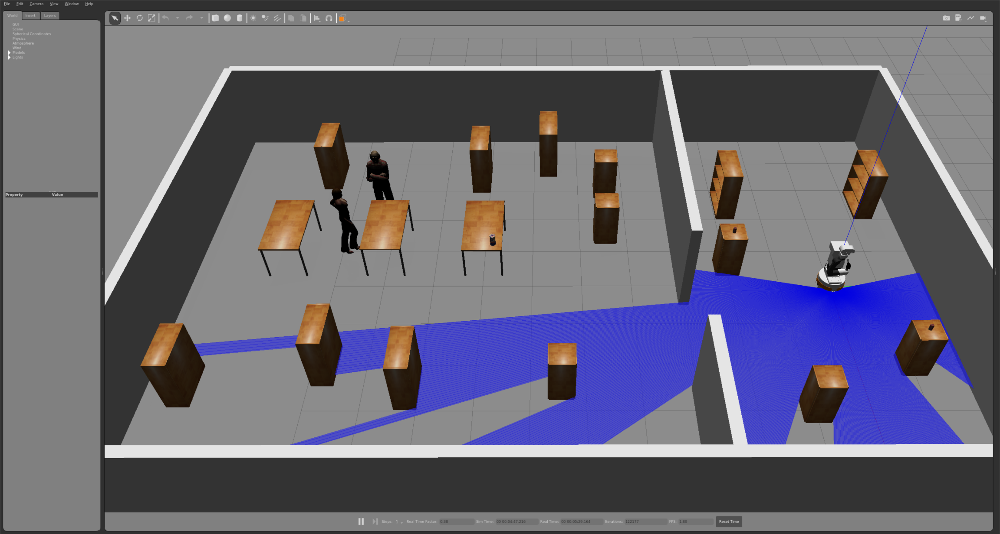
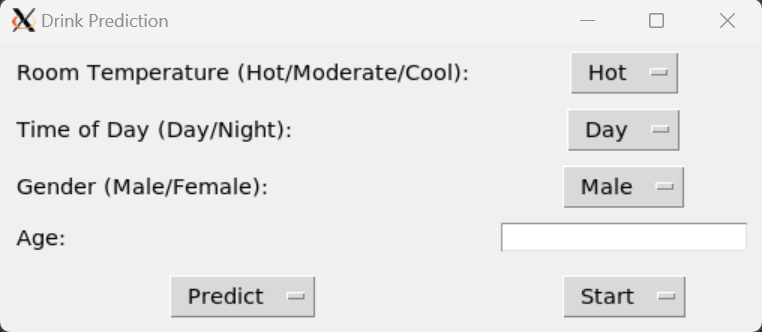

```bash
git clone git@github.com:jingzhang00/reasoning_navigation_pointout.git
cd ssy236_project
pip install -r requirements.txt
cd rearrange_ws
```

# How to use
Make sure you are under file path `reasoning_navigation_pointout/rearrange_ws`.

Then more instructions are in [README](rearrange_ws/src/rearrange/README.md)

[Demo video](/demo/demo.mp4)

## Environment


## User interface


`Predict` button will show the predicted drink based on given information.

`Start` button will start to fetch the drink.